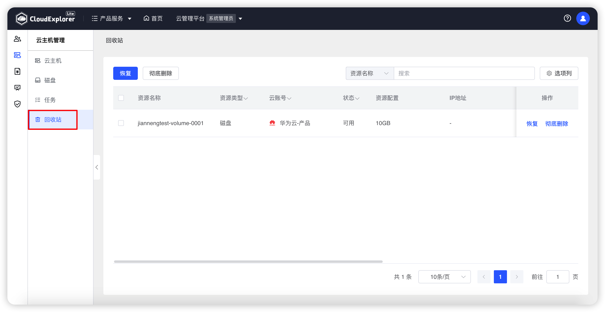
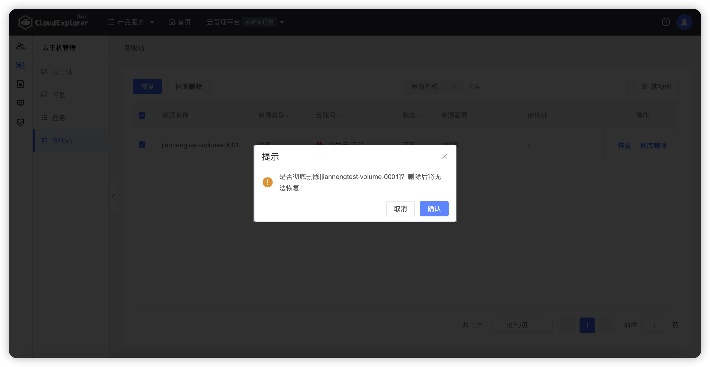

!!! Abstract ""

    当【管理中心】-【系统设置】-【参数设置】中的回收站状态开启时，用户删除云主机和云磁盘会将所删除的资源关机后放入回收中，不会直接删除。在回收站中执行【彻底删除】操作才会将所删除的资源在云平台上删除。

    回收站状态关闭时，当删除云主机和云磁盘时，会将所删除的资源直接在云平台上彻底删除。

{ width="1235px" }

## 1 恢复

!!! Abstract ""

    若用户误删除云主机或磁盘，可以在回收站中将其恢复。

    恢复云主机有两种方式： 
    - 方式一：回收站列表的【操作】-【恢复】，对单个云主机进行恢复。 
    - 方式二：回收站列表上方的【恢复】，可对多个云主机进行批量恢复。 

!!! Abstract ""

    __情况说明：__ 
    - 云主机恢复时其挂载的云磁盘也会跟随恢复。 
    - 云状态恢复时不会执行开机操作，若需开机在恢复后到云主机列表执行操作。

{ width="1235px" }
{ width="1235px" }

!!! Abstract ""

    对云主机进行恢复操作后，会在【任务】列表生成一条云主机恢复的任务。 

## 2 彻底删除

!!! Abstract ""

    若用户想彻底删除云主机或磁盘，可以在回收站中进行彻底删除操作。

    彻底删除云主机有两种方式： 
    - 方式一：回收站列表的【操作】-【彻底删除】，对单个云主机进行彻底删除。 
    - 方式二：回收站列表上方的【彻底删除】，可对多个云主机进行批量彻底删除。 

{ width="1235px" }
{ width="1235px" }

!!! Abstract ""

    对云主机进行彻底删除操作后，会在【任务】列表生成一条云主机彻底删除的任务。 