!!! Abstract ""

    所有纳管云账号的云服务器资源均会被同步到云主机列表中。 
    由于云主机的属性较多，当页面显示的列数过多时，为方便用户查看和操作，特将云主机列表页面“名称”和“操作”列的显示设为固定冻结状态。 

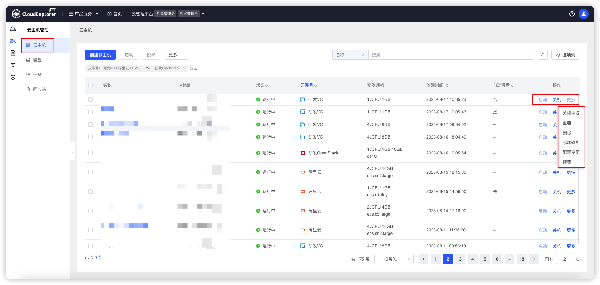{ width="1235px" }

## 1 查看云主机详情

!!! Abstract ""

    在【云主机管理】-【云主机】列表中，可以查看云主机的基本信息，包括：名称、IP 地址、状态、云账号、实例规格等。 
    不同角色用户所查看到的云主机会有所不同。“系统管理员”角色用户能查看到平台上所纳管全部云账号下的云主机；“组织管理员”角色用户能查看到授权到本组织下的所有云主机；“普通用户”角色用户可以查看到授权到本工作空间下的所有云主机。

    操作方式：在云主机列表点击云主机名称，进入所选云主机的详情页面，可查看云主机详情和监控信息。

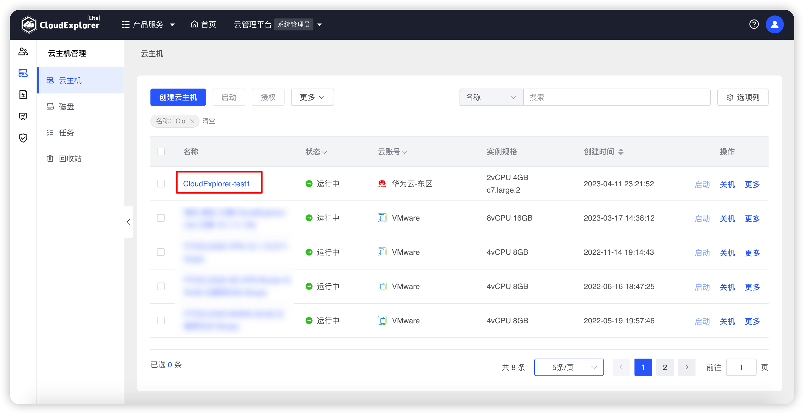{ width="1235px" }

- 详情

!!! Abstract ""

    云主机详情包括云主机基本信息和网络信息。 
    基本信息包括云主机ID、名称、所属云账号、实例规格、创建时间等内容。 
    网络信息包括机器 IP 地址、子网、VPC、安全组。 

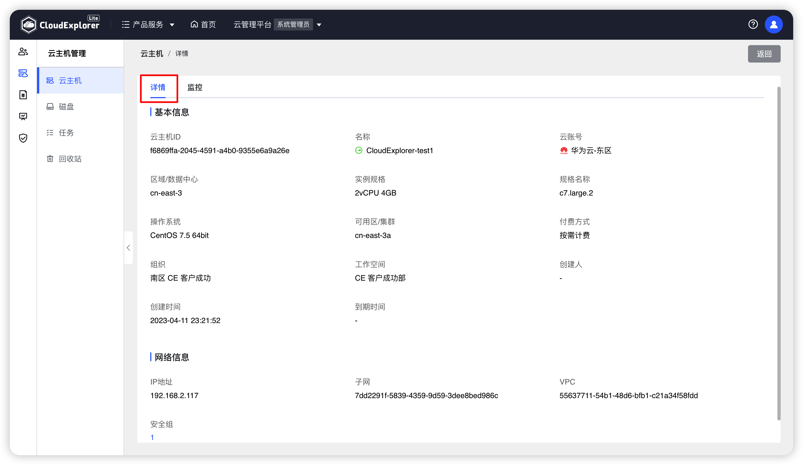{ width="1235px" }

- 监控

!!! Abstract ""

    云管平台通过各云平台 API 获取云主机的监控数据。公有云部分监控数据需要在各公有云平台云主机上安装云平台提供的监控，未安装监控的云主机会有如下提示，已安装的不会有提示 

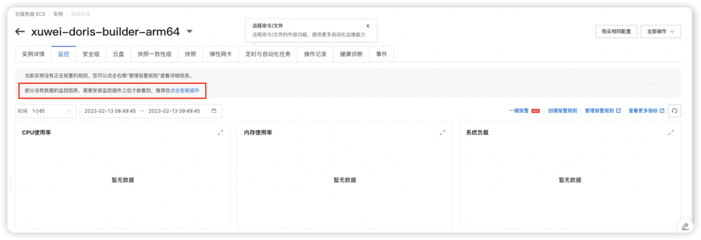{ width="1235px" }

!!! Abstract ""

    云主机监控数据包括：CPU 使用率、内存使用率、磁盘读写 BPS、磁盘每秒读取次数 IOPS、 内网流入流出带宽、磁盘挂在点使用率、公网流入流出带宽。

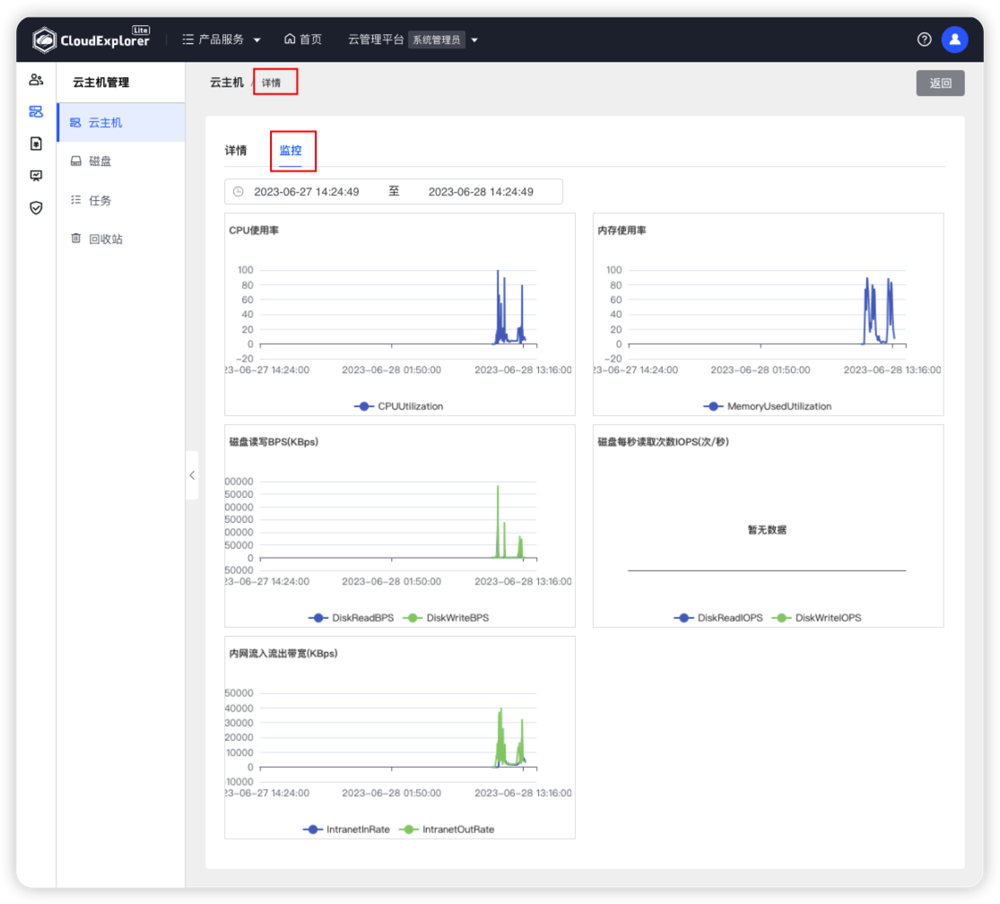{ width="1235px" }

## 2 授权

!!! Abstract ""

    云主机可进行授权和取消授权操作。 
    通过云主机授权功能可以将云主机授权到相应的组织或工作空间。 
    授权过的云主机可以取消授权，取消授权后的云主机会清空组织和工作空间信息变为未授权状态，未授权的云主机只有系统管理员可以查看和管理。

!!! Abstract ""

    __情况说明：__ 
    - 若系统管理员知道云主机属于哪个工作空间，可以直接将云主机授权到对应的工作空间下。 
    - 若系统管理员仅知道云主机属于某个组织下，而不确定具体属于哪个工作空间，系统管理员可以将云主机授权到对应的组织，由其组织管理员在授权到下面的子组织或工作空间。 
    - 云主机被授权后其关联的云磁盘也会被授权到对应的组织或工作空间中。 

- 授权

!!! Abstract ""

    “系统管理员”角色用户可对全部云主机进行授权到组织或工作空间操作；“组织管理员”角色用户可将本组织的云主机授权到本组织的工作空间下，或将已授权到工作空间的云主机改授权到本组织其他工作空间下；“普通用户”角色用户无法对云主机进行授权操作。

!!! Abstract ""

    在云主机列表中勾选要授权的云主机，点击【更多操作】-【授权】，打开云主机授权页面，选择【授权】，可对选中云主机进行批量授权操作。

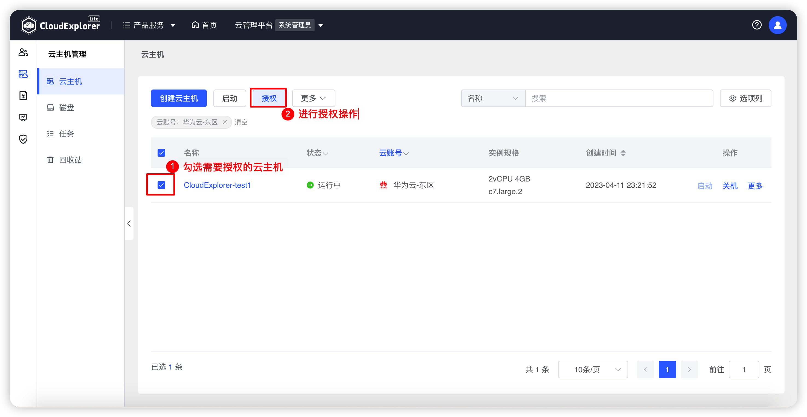{ width="1235px" }

!!! Abstract ""

    若要授权到组织，就勾选所要授权的组织，点击保存。授权完成后，组织字段显示所授权的组织 

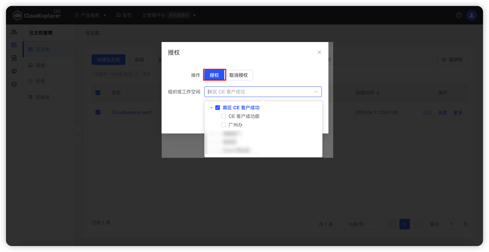{ width="1235px" }
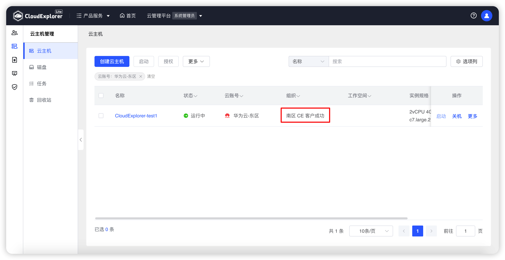{ width="1235px" }

!!! Abstract ""

    若要授权到工作空间就选择所要授权的工作空间，点击保存。授权完成后，工作空间显示所授权的工作空间，组织显示工作空间的上级组织。

{ width="1235px" }
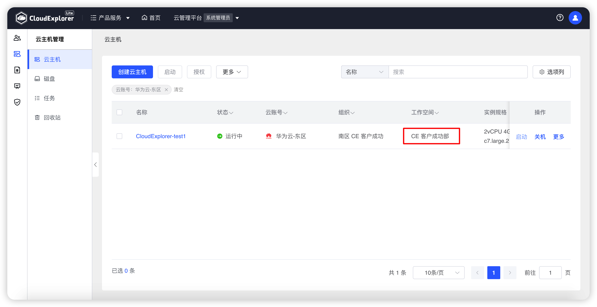{ width="1235px" }

- 取消授权

!!! Abstract ""

    “系统管理员”角色用户可对全部已授权云主机进行取消授权操作；“组织管理员”角色用户可对本组织的云主机进行取消授权操作；“普通用户”角色用户无法对云主机进行取消授权操作。

!!! Abstract ""

    在云主机列表勾选取消授权的云主机，点击【更多操作】-【授权】，打开授权页面，选择【取消授权】，可对选中云主机进行批量取消授权操作。

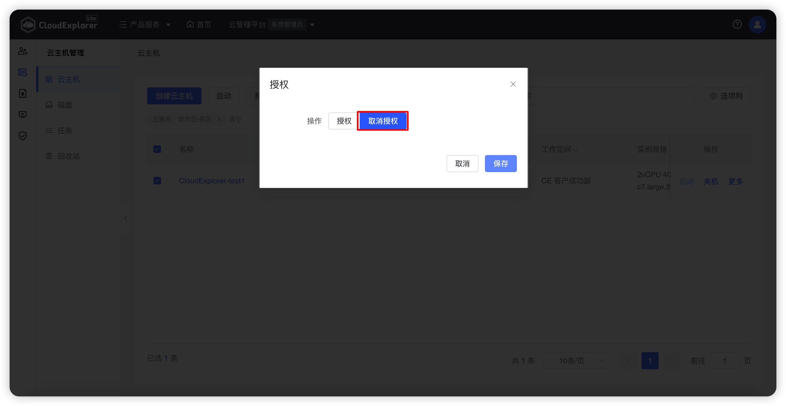{ width="1235px" }

!!! Abstract ""
    
    取消授权前云主机有组织和工作空间。取消授权后云主机无组织和工作空间。 

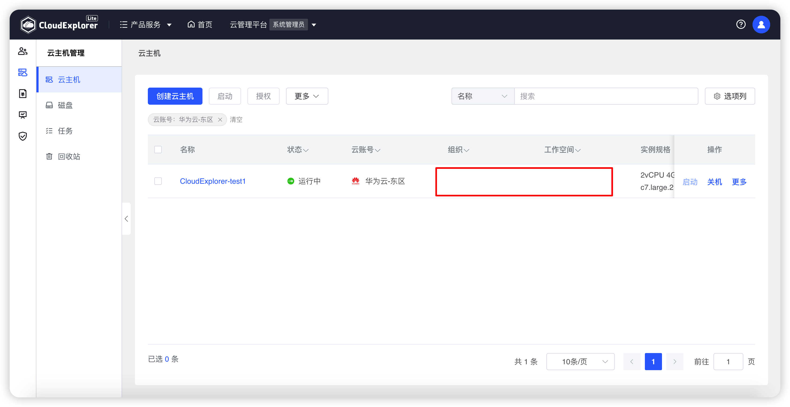{ width="1235px" }

## 3 启动

!!! Abstract ""

    已关机的云主机可以进行启用操作。
    
    启动云主机有两种方式： 
    - 方式一：云主机列表的【操作】-【启动】，可对选中机器进行启动操作。 
    - 方式二：云主机列表上方的【启动】，可对选中机器进行批量启动。 

{ width="1235px" }

!!! Abstract ""

    对云主机进行启用操作后，会在【任务】列表中生成一条云主机启用任务。 

## 4 关机

!!! Abstract ""

    运行中的云主机可以进行关机操作。
    
    云主机关机有两种操作方式： 
    -方式一：云主机列表的【操作】-【关机】，可对选中机器进行关机操作。 
    -方式二：云主机列表上方【关机】，可对选中机器进行批量关机。 

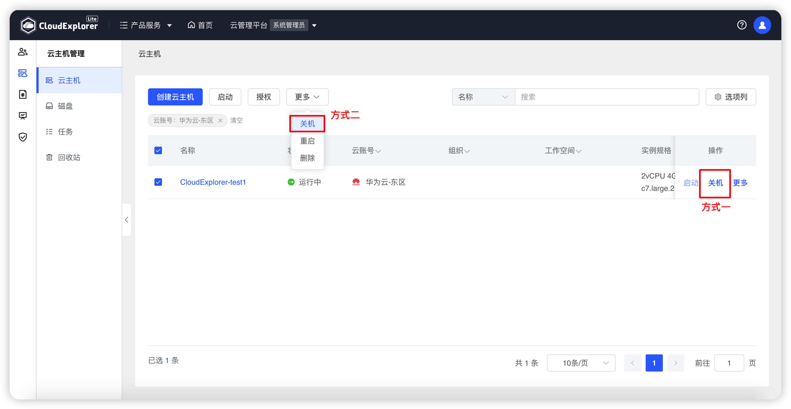{ width="1235px" }

!!! Abstract ""

    对云主机进行关机操作后，会在【任务】列表生成一条云主机关机任务。 

## 5 关闭电源

!!! Abstract ""

    运行中的 VMware 云主机可以进行关闭电源操作。  

    操作方式：云主机列表中【操作】-【更多】-【关闭电源】。 

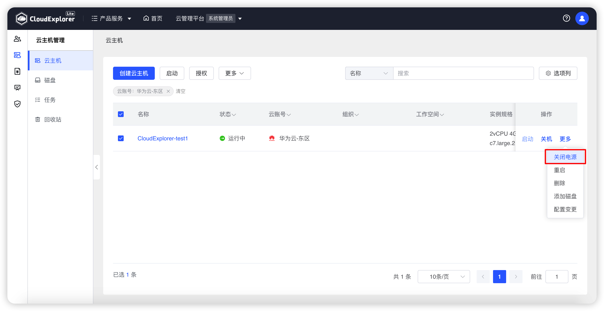{ width="1235px" }

!!! Abstract ""

    对云主机进行关闭电源操作后，会在【任务】列表生成一条云主机关闭电源的任务。 

## 6 重启

!!! Abstract ""

    运行中的云主机可以进行重启操作。
    
    云主机重启有两种操作方式： 
    -方式一：云主机列表的【操作】-【更多】-【重启】，对选中机器进行重启。 
    -方式二：云主机列表上方的【重启】，可对选中机器进行批量重启。 

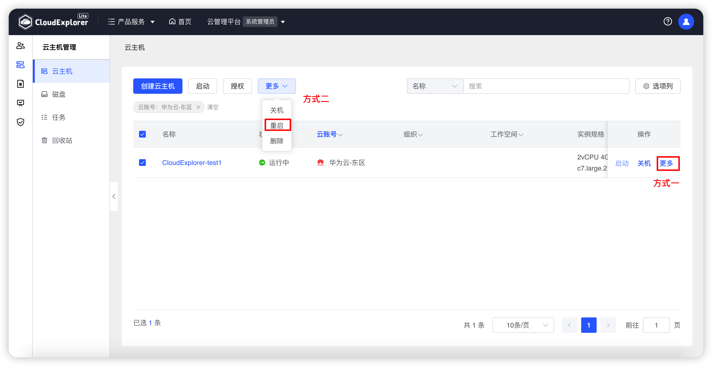{ width="1235px" }

!!! Abstract ""

    对云主机进行重启操作后，会在【任务】列表生成一条云主机重启的任务。 

## 7 配置变更

!!! Abstract ""

    云管平台支持对云主机进行配置变更操作。

    操作方式：云主机列表-【操作】-【更多】-【配置变更】。 

{ width="1235px" }
    
!!! Abstract ""

    VMware 云主机配置变更可以自行设置要变更的配置大小。 
    如有设置计费策略，配置变更时会显示预估费用

{ width="1235px" }
   
  
!!! Abstract ""

    OpenStack 和公有云云主机配置变更需要选择实例规格。 

{ width="1235px" }

!!! Abstract ""

    配置变更将会对云主机进行关机操作，请谨慎操作。

{ width="1235px" }

!!! Abstract ""

    对云主机进行配置变更操作后，会在【任务】列表生成一条云主机配置变更的任务。 

## 8 添加磁盘

!!! Abstract ""

    云管平台支持对云主机进行添加磁盘操作。

    操作方式：云主机列表的【操作】-【更多】-【添加磁盘】。 

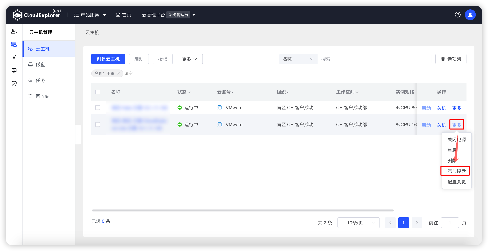{ width="1235px" }

!!! Abstract ""

    VMware 云主机添加磁盘时，需要选择磁盘格式、磁盘模式、存储器，并设置磁盘大小。 

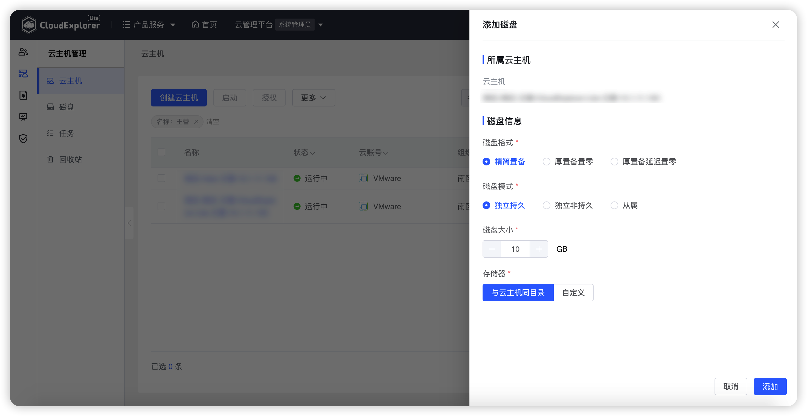{ width="1235px" }

!!! Abstract ""

    OpenStack 云主机添加磁盘时，需要定义磁盘名称和大小，选择磁盘类型，并输入磁盘描述。 

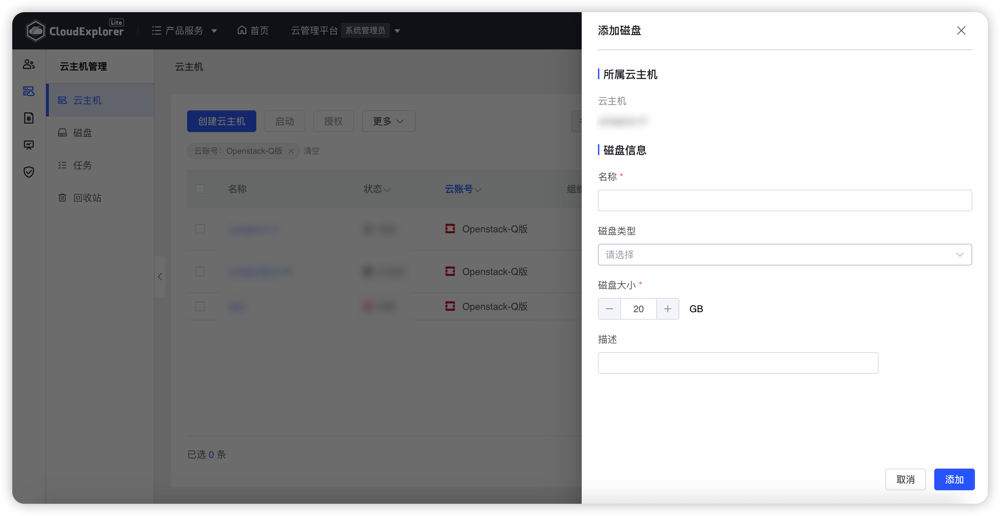{ width="1235px" }

!!! Abstract ""

    公有云云主机添加磁盘时，需要选择磁盘类型，输入磁盘名称和磁盘大小，并选择是否随实例删除等。 

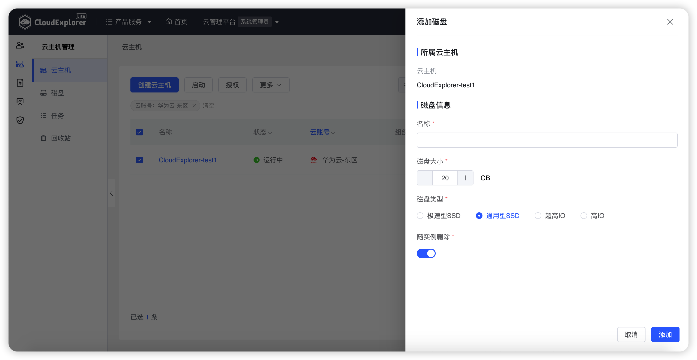{ width="1235px" }

!!! Abstract ""

    对云主机进行添加磁盘操作后，会在【任务】列表生成一条云主机添加磁盘的任务。 

## 9 删除

!!! Abstract ""

    针对云主机和云磁盘的删除，云管平台平台提供的回收站功能。若【管理中心】-【系统设置】-【参数设置】中的回收站策略开启，用户删除云主机时，云管平台会将云主机置为【待回收】状态放入回收站中，并不会直接删除云主机。若回收站策略未开启，当用户删除云主机时，将会直接彻底删除云主机。

    云主机删除有两种操作方式： 
    -方式一：云主机列表的【操作】-【更多】-【删除】，对单台云主机进行删除。 
    -方式二：云主机列表上方【更多操作】-【删除】，可选中多台云主机进行批量删除。 

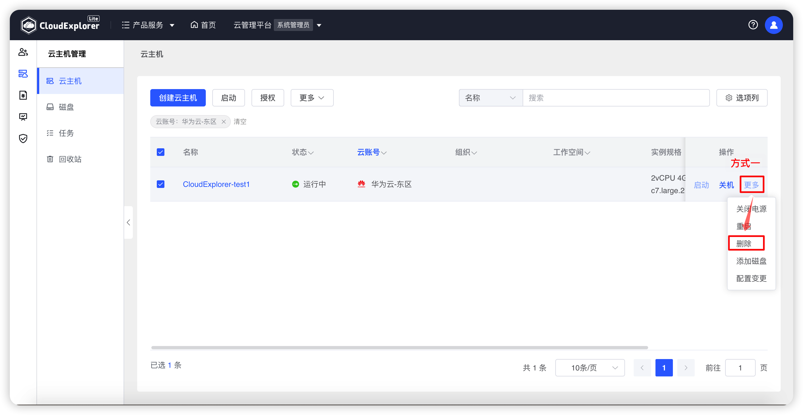{ width="1235px" }
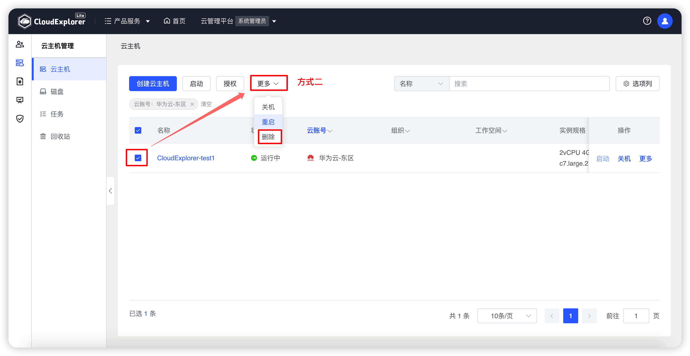{ width="1235px" }

!!! Abstract ""

    对云主机进行删除操作后，会在【任务】列表生成一条云主机删除的任务。 