!!! Abstract ""

    系统管理员登录云平台后第一步需要纳管云账号，云管平台通过云账号拿到授权后才可以对云资源进行一些管理操作。

    创建云账号有两种方式，新部署或者未纳管云账号的云管平台在 admin 登录后会自动弹出添加云账号的对话框。<br />
    - 方式一：【首页】-【快捷入口】-【添加云账号】。<br />
    - 方式二：【管理中心】-【云账号】-【添加】。<br />

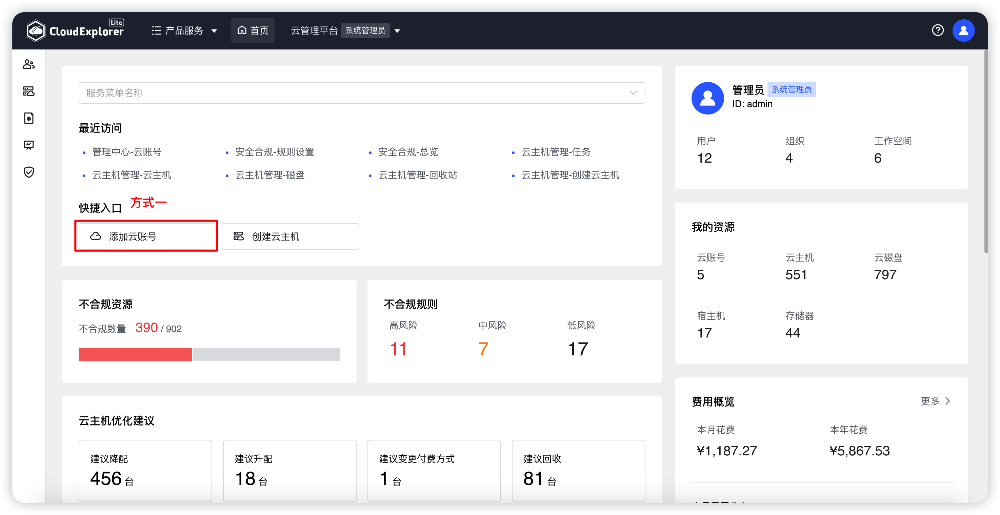{ width="1235px" }

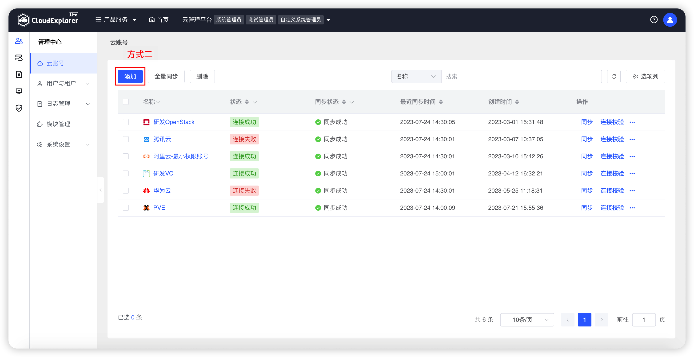{ width="1235px" }

## 1 添加阿里云账号

!!! Abstract ""
    阿里云在 API 调用时需要验证访问者的身份，以确保访问者具有相关权限。这种验证方式通过 Access Key 来实现，Access Key 由阿里云颁发给云主机的所有者，它由 Access Key ID 和 Access Key Secret 构成，所以在创建云账号时，需要填入 Access Key ID 和 Access Key Secret。
    ```
    阿里云 Accesskey 权限要求：
    - 授权范围：整个云账号
    - 授权策略：AliyunECSFullAccess、AliyunEIPFullAccess、ReadOnlyAccess
    ```

!!! Abstract ""
    第一步：选择云平台（阿里云）。<br />
    
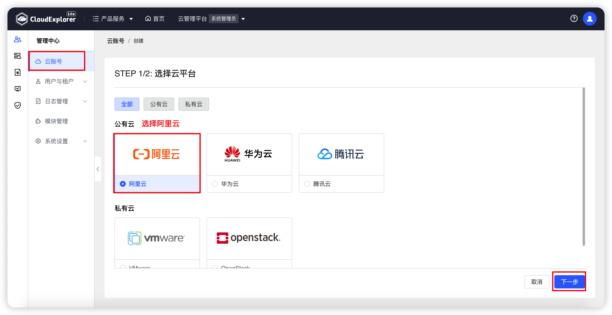{ width="1235px" }

!!! Abstract ""

    第二步：输入云账号名称、AccessKeyId、AccessKeySecret。<br />

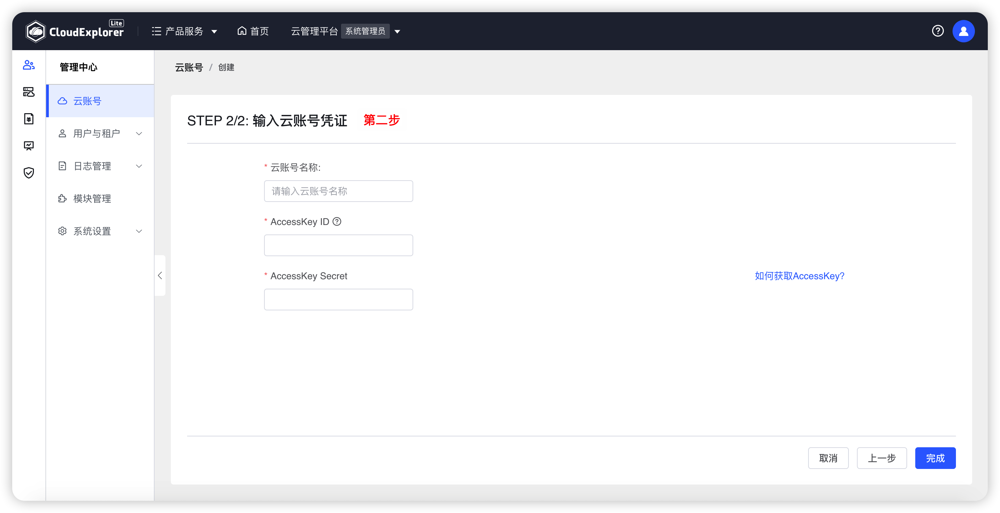{ width="1235px" }

!!! Abstract ""

    __字段说明：__<br />
    - 云账号名称：云管平台定义的字段用于区分云账号的标识，名称唯一。<br />
    - AccessKeyId：阿里云账号授权API访问的密钥ID。<br />
    - AccessKeySecret：阿里云账号授权API访问的密钥ID对应的密钥。
 
!!! Abstract ""

    点击“确认”后，云管平台校验通过后保存成功，返回云账号列表页面，新增的云账号状态为同步中，云管平台会全量同步云主机、云磁盘、镜像等资源数据，还会同步过去一年的账单数据。

    
## 2 添加腾讯云账号

!!! Abstract ""

    腾讯云在 API 调用时需要验证访问者的身份，以确保访问者具有相关权限。这种验证方式通过 secret 来实现，Secret 由 SecretId 和 SecretKey 构成，所以在创建云账号时，需要填入 SecretId 和 SecretKey 。
    ```
    腾讯云 SecretKey 权限要求：
    - 授权策略：QcloudCVMFullAccess、QCloudFinanceFullAccess、ReadOnlyAccess
    ```

!!! Abstract ""

    第一步：选择云平台（腾讯云）。<br />
    
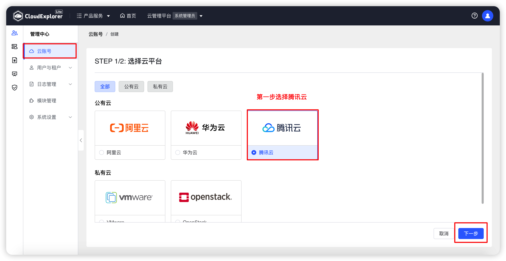{ width="1235px" }

!!! Abstract ""

    第二步：输入云账号名称、SecretId、SecretKey。<br />
    
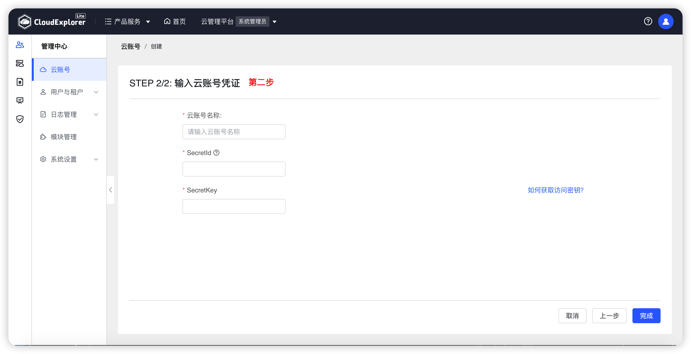{ width="1235px" }

!!! Abstract ""

    __字段说明：__<br />
    - 云账号名称：云管平台定义的字段用于区分云账号的标识，名称唯一。<br />
    - SecretId：腾讯云账号在云 API 密钥上申请的标识身份 ID，一个 SecretId 对应唯一的 SecretKey。<br />
    - SecretKey：腾讯云账号授权 API 访问的密钥ID对应的密钥。
 

!!! Abstract ""

    点击“确认”后，云管平台校验通过后保存成功，返回云账号列表页面，新增的云账号状态为同步中，云管平台会全量同步云主机、云磁盘、镜像等资源数据，还会同步过去一年的账单数据。

## 3 添加华为云账号

!!! Abstract ""

    华为云在 API 调用时需要验证访问者的身份，以确保访问者具有相关权限。所以在创建云账号时，需要填入 AccessKey 和 SecretKey。
    ```
    华为云 Accesskey 权限要求：
    - 授权范围：所有资源
    - 授权策略：Server Administrator、Tenant Guest
    ```

!!! Abstract ""

    第一步：选择云平台（华为云）。<br />

{ width="1235px" }

!!! Abstract ""

    第二步：输入云账号名称、AccessKey、SecretKey。<br />

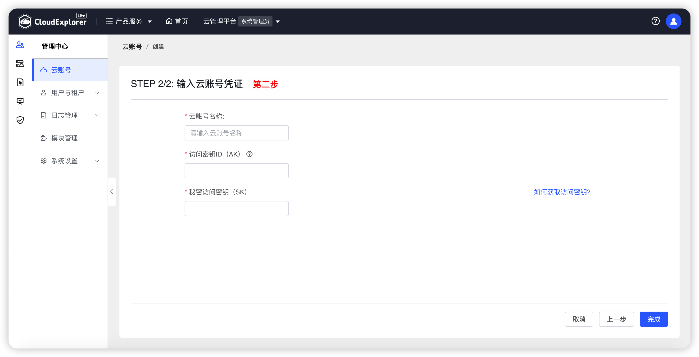{ width="1235px" }

!!! Abstract ""

    __字段说明：__<br />
    - 云账号名称：云管平台定义的字段用于区分云账号的标识，名称唯一。<br />
    - AccessKey：华为云账号授权 API 访问用户的用户名。<br />
    - SecretKey：华为云账号授权 API 访问用户名对应的密钥。
 
!!! Abstract ""

    点击“确认”后，云管平台校验通过后保存成功，返回云账号列表页面，新增的云账号状态为同步中，云管平台会全量同步云主机、云磁盘、镜像等资源数据，还会同步过去一年的账单数据。

## 4 添加 OpenStack 云账号

!!! Abstract ""

    OpenStack 支持版本为：OpenStack Z 版本。

!!! Abstract ""

    第一步：选择云平台（OpenStack）。<br />

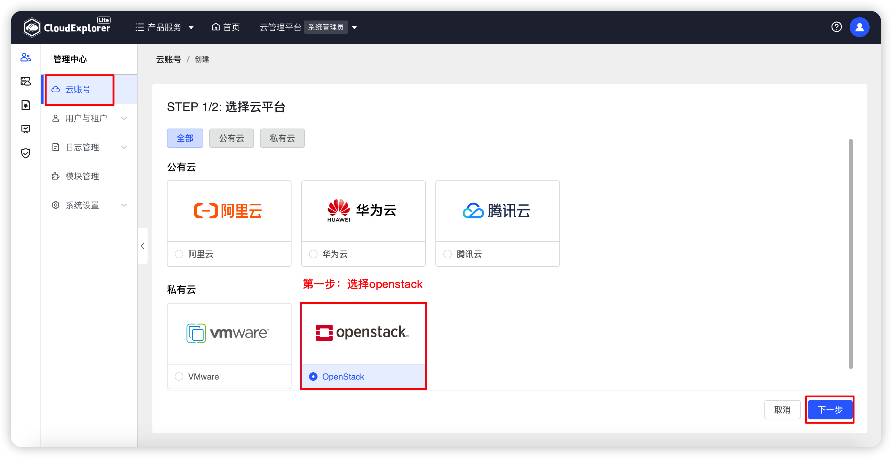{ width="1235px" }

!!! Abstract ""

    第二步：输入云账号名称、Domain ID、Project ID、用户 ID、密码、认证地址。<br />

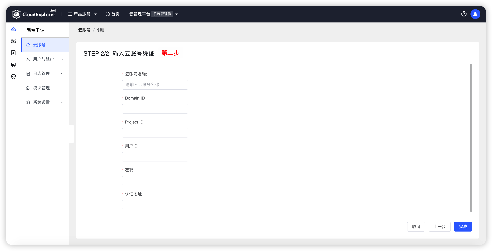{ width="1235px" }

!!! Abstract ""

    __字段说明：__<br />
    - 云账号名称：云管平台定义的字段用于区分云账号的标识，名称唯一。<br />
    - Domain ID：OpenStack 账号域 ID。<br />
    - Project ID：OpenStack 账号项目 ID。<br />
    - 用户 ID：OpenStack 账号授权 API 访问用户的用户 ID。<br />
    - 密码：OpenStack 账号授权 API 访问用户名对应的密码。<br />
    - 认证地址：OpenStack 账号身份认证地址。
 
!!! Abstract ""

    点击“确认”后，云管平台校验通过后保存成功，返回云账号列表页面，新增的云账号状态为同步中，云管平台会全量同步云主机、云磁盘、镜像等资源数据。

## 5 添加 VMware 云账号

!!! Abstract ""

    VMware 支持版本为：VMware 7.0.3 版本。

!!! Abstract ""

    第一步：选择云平台（VMware）。<br />

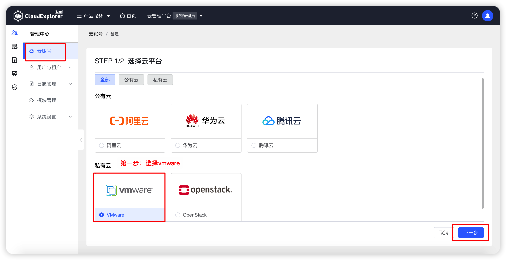{ width="1235px" }

!!! Abstract ""

    第二步：输入云账号名称、用户名、密码、认证地址。<br />

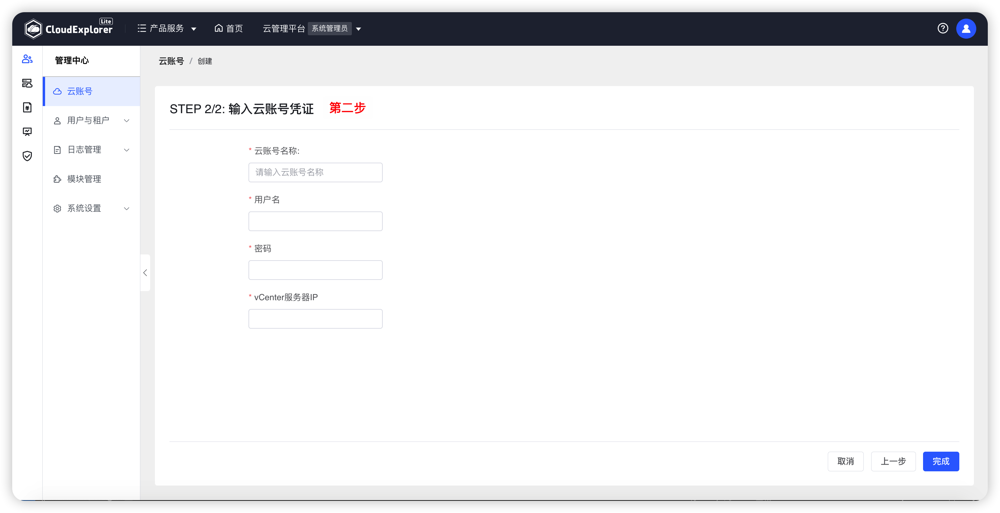{ width="1235px" }

!!! Abstract ""

    __字段说明：__<br />
    - 云账号名称：云管平台定义的字段用于区分云账号的标识，名称唯一。<br />
    - 用户名：VMware 账号授权 API 访问用户的用户名。<br />
    - 密码：VMware 账号授权 API 访问用户名对应的密码。<br />
    - vCenter服务器IP：vCenter 所在服务器 IP 地址。
 
!!! Abstract ""

    点击“确认”后，云管平台校验通过后保存成功，返回云账号列表页面，新增的云账号状态为同步中，云管平台会全量同步云主机、云磁盘、镜像等资源数据。

## 6 查看云账号详情

!!! Abstract ""

    云账号添加成功后，云账号列表中将会显示已添加的云账号数据。主要展示云账号名称、云平台、账号状态、同步状态、最近同步时间、创建时间字段。

    操作：在云账号列表中，点击具体云账号名称可查看云账号详情，主要展示内容包括当前云账号基本信息、我的资源情况、数据同步设置、同步记录和详情。

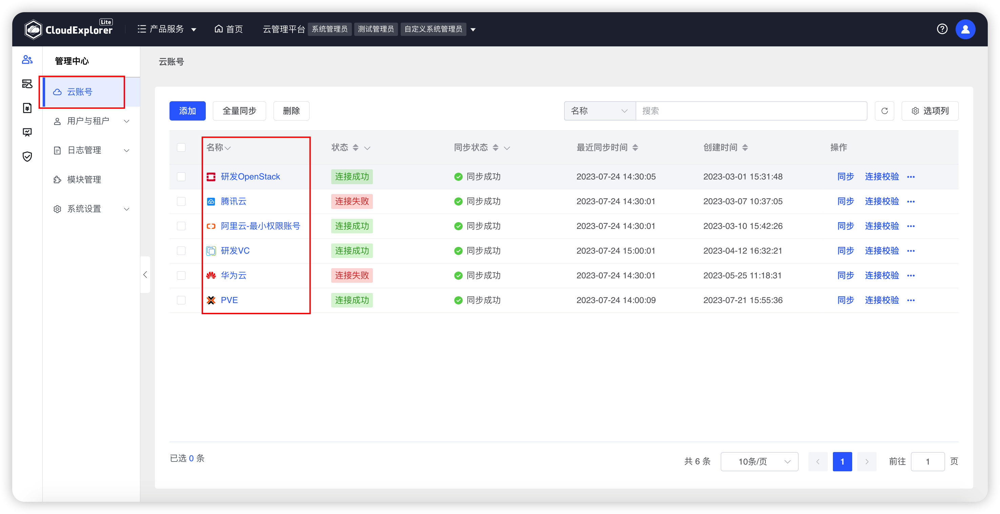{ width="1235px" }  

{ width="1235px" }

## 7 校验云账号

!!! Abstract ""

    在云账号列表中，选择需要进行校验的云账号，点击列表右侧“操作”列中的“校验”图标，云管平台会使用云账号中设置的账号信息调用获取区域的API。
    
    调用成功：则校验成功，云账号的有效状态为有效；<br />
    调用失败：则校验失败，云账号的有效状态为无效。

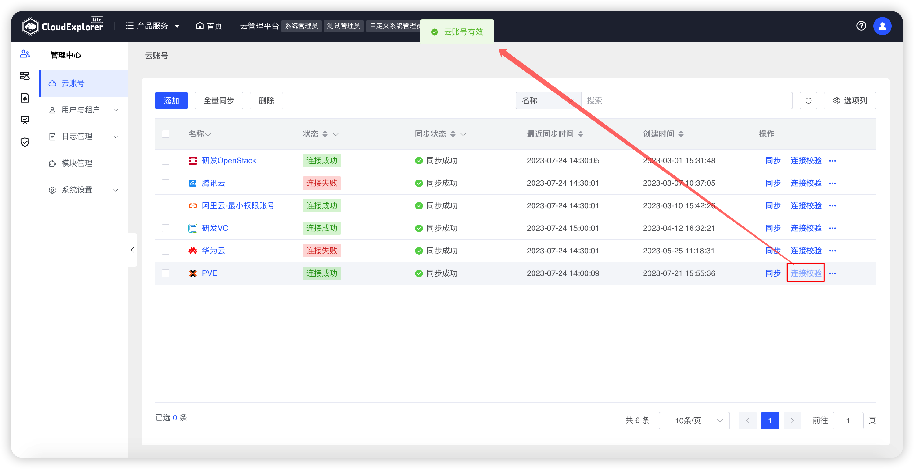{ width="1235px" }  

## 8 编辑云账号

!!! Abstract ""

    当云账号的账号信息过期需要更新时，可编辑云账号进行修改即可。
    
    操作：在云账号列表中，选择需要编辑的云账号，点击列表右侧“操作”列中的“编辑”图标，可以修改云账号所有属性。

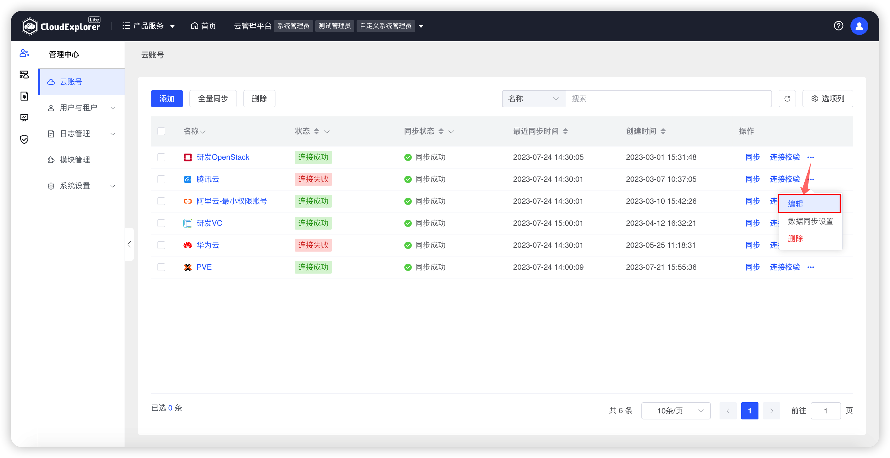{ width="1235px" }  

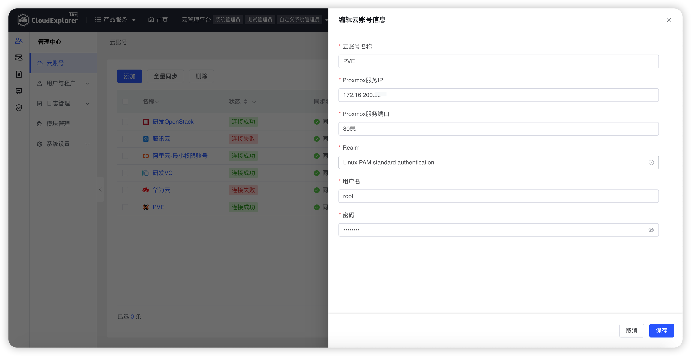{ width="1235px" }  

## 9 删除云账号

!!! Abstract ""

    当云管平台不再需要管理某个云账号时，或者用户不再使用某个云账号时，可以在云管平台将该云账号删除。

    操作：在云账号列表中，选择需要删除的云账号，点击列表右侧“操作”列中的“删除”选项，页面会出现点再次确认弹窗，再次点击“删除”后，云管平台会将该云账号所有同步到本地的数据清空，不会影响云平台上的所有的数据。

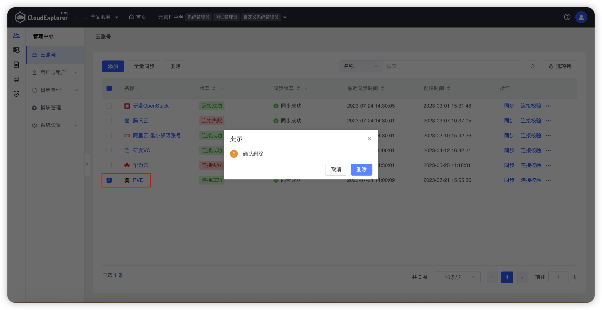{ width="1235px" }  

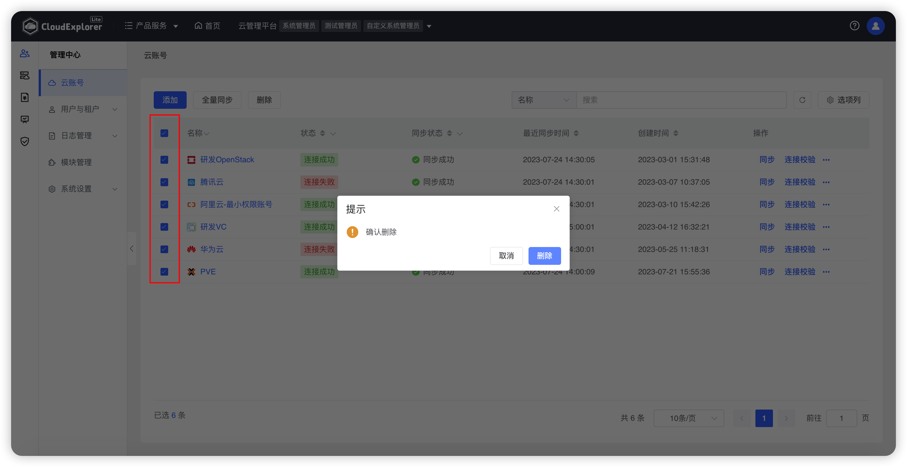{ width="1235px" }  