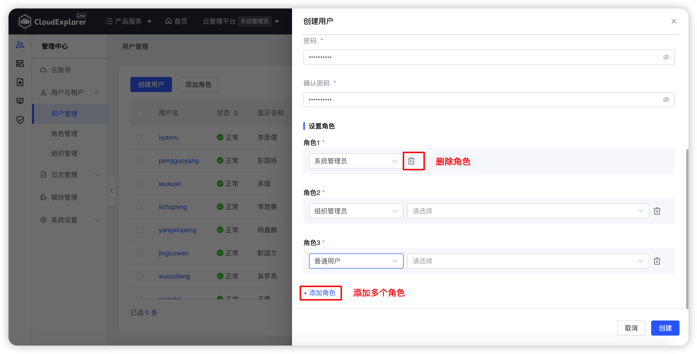
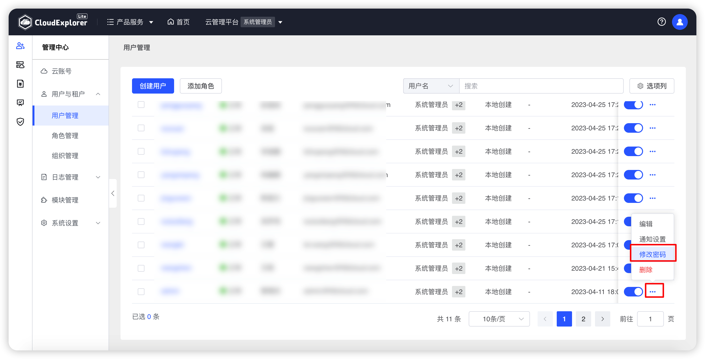

!!! Abstract ""

    用户可以拥有多个角色，比如既可以是系统管理员，也可以是组织 A 和组织 B 的组织管理员，也可以是组织 C 下面某个工作空间的用户。

## 1 创建用户

!!! Abstract ""

    创建用户有两种方式：<br />
    - 方式一：【首页】-【快捷入口】-【创建用户】。<br />
    - 方式二：【【管理中心】-【用户】-【创建】。

{ width="1235px" }
{ width="1235px" }

!!! Abstract ""

    创建用户时，要填写工作空间基本信息并设置角色，保存时系统会校验工作空间名称的唯一性。<br />
    点击基本信息下方添加图标可以同时设置多个角色。在设置多个角色时点击角色后面的删除图标可以删除一个角色。

{ width="1235px" }

!!! Abstract ""

    __字段说明：__ <br />
    · 基本信息<br />
    - ID：登录云管平台的用户名，用户 ID 必须唯一。<br />
    - 名称：用户真实姓名，云管平台中用户相关操作显示该名称。<br />
    - Email: 用户接收通知的邮箱，Email 必须唯一且必填。<br />
    - 手机号码：接受短信通知的手机号，非必填。<br />
    - 密码：登录云管平台的密码。<br />
    - 确认密码：登录云管平台的密码。<br />

    · 设置角色<br />
    - 用户类型：分配给用户的角色类型。<br />
        ```
        若类型选择为系统管理员，则生效范围是整个云管平台。
        若类型选择组织管理员或继承组织管理员的角色，则需要设置当前角色在哪些组织下生效。
        若类型选择为普通用户，则需要设置当前角色在哪些工作空间下生效。
        ```

## 2 编辑用户

!!! Abstract ""

    当需要对用户信息或用户角色进行调整时，可以编辑用户进行信息修改。除 ID 外其他用户信息均可以编辑。

    操作：在用户列表中，选择需要编辑的用户，点击列表右侧“操作”列中的“编辑”图标，可以修改用户属性。

{ width="1235px" }
{ width="1235px" }

## 3 修改密码

!!! Abstract ""

    当用户忘记密码时，管理员可以修改用户的密码。

    操作：在用户列表中，选择需要修改密码的用户，点击列表右侧“操作”列中的“修改密码”图标，可以修改用户登录密码。

{ width="1235px" }
{ width="1235px" }

## 4 通知设置

!!! Abstract ""

    可对用户进行通知设置，配置用户接收系统通知的邮箱、手机号和企业微信账号。邮箱、手机号设置后将与用户基本信息关联。手机号将做为钉钉平台推送标识。

    操作：在用户列表中，选择需要进行通知设置的用户，点击列表右侧“操作”列中的“通知设置”图标，可以设置用户通知账号。

{ width="1235px" }
{ width="1235px" }

## 5 删除用户

!!! Abstract ""

    当角色已经不再使用时，可以删除该角色。若删除正在使用的角色，关联了该角色全部用户将会被取消关联。

    操作：在角色列表中，选择需要删除的角色，点击列表右侧“操作”列中的“删除”选项，页面会出现点再次确认弹窗，再次点击“删除”即可删除该角色。

{ width="1235px" }
{ width="1235px" }